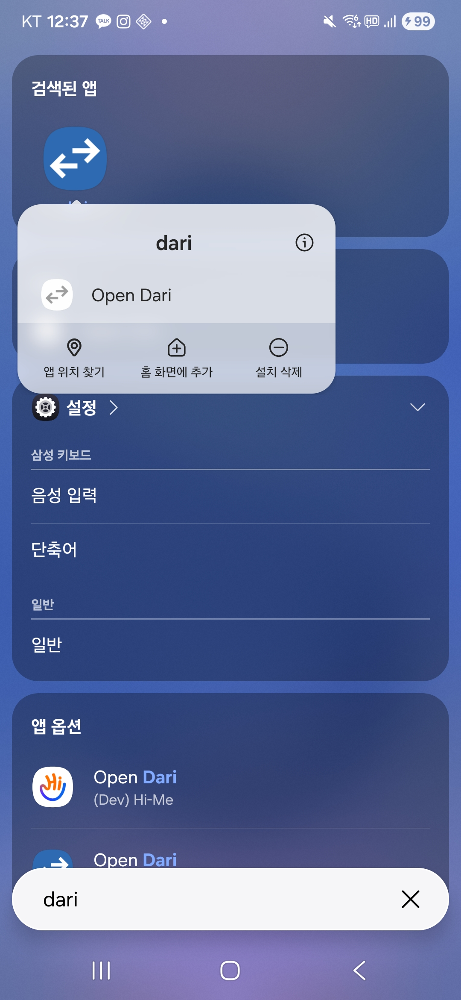
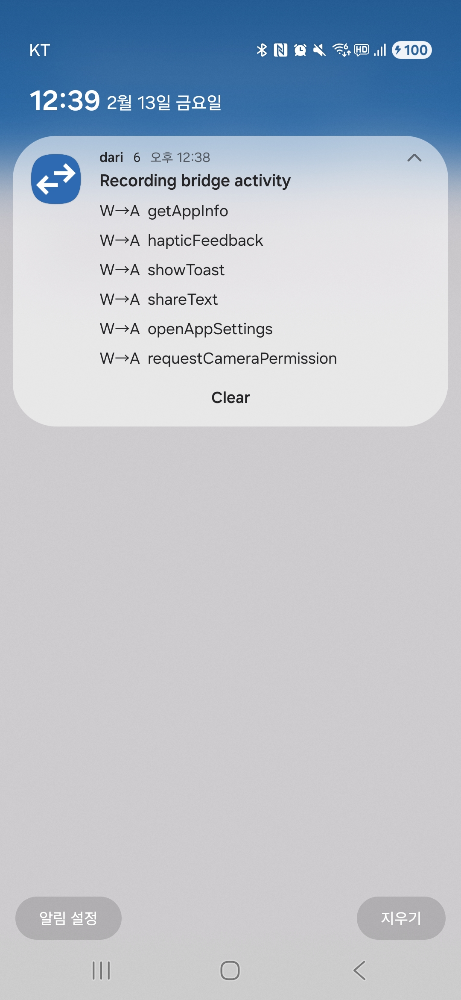
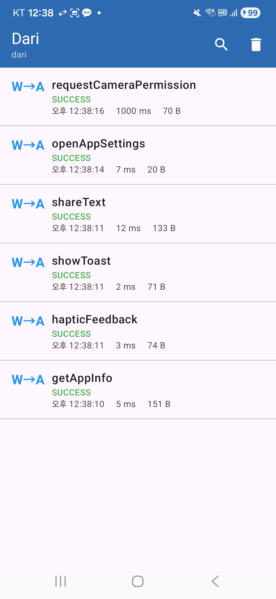
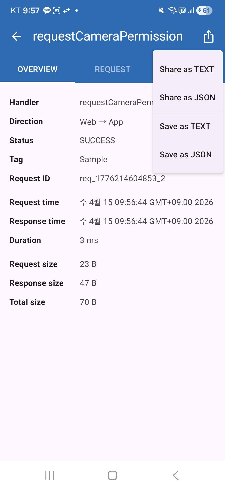
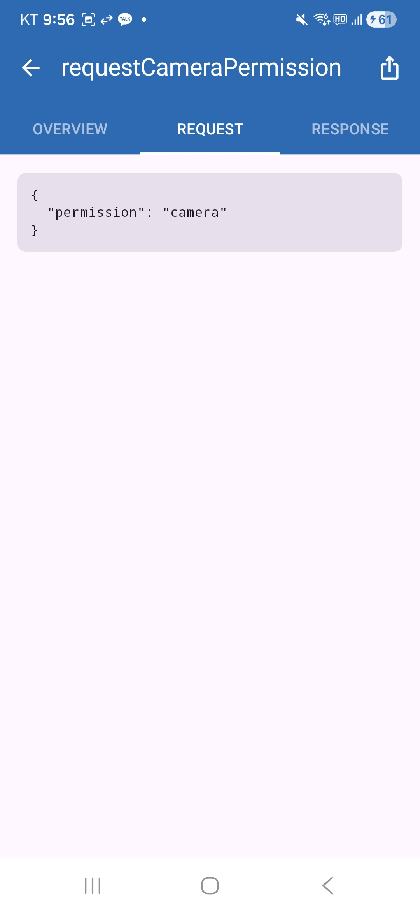
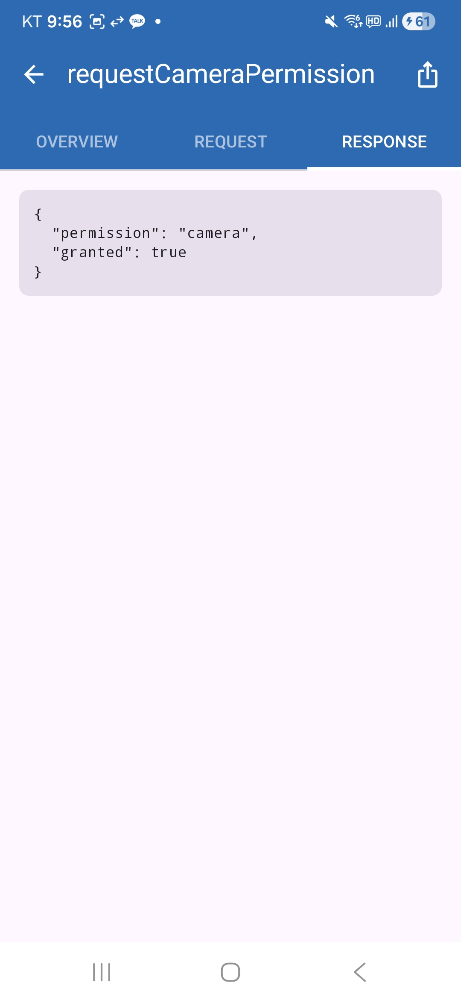

# Dari

[](https://central.sonatype.com/artifact/io.github.easyhooon/dari)

**Dari** (다리) means **"bridge"** in Korean. Dari is a lightweight Android library for inspecting WebView bridge communication in real time, inspired by [Chucker](https://github.com/ChuckerTeam/chucker).

Just as Chucker intercepts and displays HTTP traffic, Dari captures and visualizes **WebView JavaScript bridge messages** between your web content and native Android code.

## Screenshots

<p align="center">
  
  
  
</p>
<p align="center">
  
  
  
</p>

## Features

- Intercepts Web-to-App and App-to-Web bridge messages
- Chucker-style persistent notification showing recent bridge activity
- Message list UI with search and filter by handler name
- Detail view with Overview / Request / Response tabs
- JSON pretty-printing for request and response payloads
- Share message details as text
- Dynamic launcher shortcut for quick access
- Zero overhead in release builds via no-op module
- Auto-initialization via `androidx.startup`

## Setup

### Gradle

Add the `dari` (debug) and `dari-noop` (release) dependencies to your app's `build.gradle.kts`:

```kotlin
dependencies {
    debugImplementation("io.github.easyhooon:dari:<latest-version>")
    releaseImplementation("io.github.easyhooon:dari-noop:<latest-version>")
}
```

That's it for initialization. Dari auto-initializes via `androidx.startup` when your app starts.

### Interceptor Integration

Dari requires **manual injection** of the interceptor into your WebView bridge layer. Create an interceptor instance and call its methods at the appropriate points in your bridge communication code.

#### 1. Create the interceptor

```kotlin
import com.easyhooon.dari.Dari
import com.easyhooon.dari.interceptor.DariInterceptor

// Returns DefaultDariInterceptor in debug builds, null in release builds
val interceptor: DariInterceptor? = Dari.createInterceptor()
```

#### 2. Intercept Web-to-App messages

When your `@JavascriptInterface` method receives a call from JavaScript:

```kotlin
class BridgeInterface(private val interceptor: DariInterceptor?) {

    @JavascriptInterface
    fun callNative(handlerName: String, requestId: String, data: String?) {
        // 1. Log the incoming request
        interceptor?.onWebToAppRequest(handlerName, requestId, data)

        // 2. Process the request
        val (responseData, isSuccess) = processRequest(handlerName, data)

        // 3. Log the outgoing response
        interceptor?.onWebToAppResponse(handlerName, requestId, responseData, isSuccess)

        // 4. Send response back to WebView
        sendResponseToWeb(requestId, responseData)
    }
}
```

#### 3. Intercept App-to-Web messages

When your native code sends a message to JavaScript:

```kotlin
fun sendMessageToWeb(webView: WebView, handlerName: String, data: String?) {
    val requestId = UUID.randomUUID().toString()

    // 1. Log the outgoing message
    interceptor?.onAppToWebMessage(handlerName, requestId, data)

    // 2. Evaluate JavaScript
    webView.evaluateJavascript("javascript:onNativeMessage('$handlerName', '$data')") { result ->
        // 3. Log the response from web
        interceptor?.onAppToWebResponse(requestId, true, result)
    }
}
```

### Custom Configuration

You can customize Dari by calling `init` with a config before auto-initialization occurs, or in your `Application.onCreate()`:

```kotlin
class MyApp : Application() {
    override fun onCreate() {
        super.onCreate()
        Dari.init(
            context = this,
            config = DariConfig(
                maxEntries = 1000,         // Default: 500
                showNotification = true,   // Default: true
            )
        )
    }
}
```

## Module Structure

```
dari/
├── dari/          ← Debug library (interceptor, UI, notifications)
├── dari-noop/     ← Release no-op (same API surface, zero overhead)
└── sample/        ← Sample app with WebView bridge demo
```

## Sample App

The `sample/` module contains a working WebView demo with realistic bridge scenarios: fetching app/device info, showing toast messages, haptic feedback, sharing via native share sheet, clipboard access, opening app settings, and requesting camera permission. Run the sample app, tap the buttons, and observe:

1. A notification appears showing recent bridge messages
2. Tap the notification to open the message list
3. Tap any message to see its details (overview, request payload, response payload)

## API Reference

### Dari

| Method | Description |
|--------|-------------|
| `init(context, config)` | Initialize with custom configuration |
| `createInterceptor()` | Create a `DariInterceptor` (returns `null` in noop) |
| `showNotification()` | Show the notification (e.g., after permission grant) |
| `clear()` | Clear all stored messages and dismiss notification |

### DariInterceptor

| Method | Description |
|--------|-------------|
| `onWebToAppRequest(handlerName, requestId, requestData)` | Log a Web-to-App request |
| `onWebToAppResponse(handlerName, requestId, responseData, isSuccess)` | Log the response to a Web-to-App request |
| `onAppToWebMessage(handlerName, requestId, data)` | Log an App-to-Web message |
| `onAppToWebResponse(requestId, isSuccess, responseData)` | Log the response to an App-to-Web message |

## License

```
Copyright 2025 easyhooon

Licensed under the Apache License, Version 2.0 (the "License");
you may not use this file except in compliance with the License.
You may obtain a copy of the License at

    http://www.apache.org/licenses/LICENSE-2.0

Unless required by applicable law or agreed to in writing, software
distributed under the License is distributed on an "AS IS" BASIS,
WITHOUT WARRANTIES OR CONDITIONS OF ANY KIND, either express or implied.
See the License for the specific language governing permissions and
limitations under the License.
```