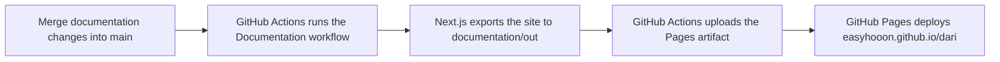

# Deploy the documentation site

The documentation site is a static Next.js export hosted on GitHub Pages. Changes under `documentation/` deploy automatically after they are merged into `main`.

## Deployment flow

The [Documentation workflow](../.github/workflows/docs.yml) builds and deploys the site without Vercel or another hosting service.



The workflow starts for these events:

- A push to `main` that changes `documentation/**` or `.github/workflows/docs.yml`
- A pull request targeting `main` that changes either path
- A manual `workflow_dispatch` run

Pull requests run the build and upload the artifact, but they do not deploy. The deploy job runs only for `main`.

## Merge changes into main

The `main` branch is protected by a repository ruleset and does not accept direct pushes. Create a branch, open a pull request, and merge the pull request into `main` to start an automatic deployment.

## Hosting configuration

The site uses these settings:

| Setting | Location | Purpose |
| --- | --- | --- |
| `output: 'export'` | [`next.config.mjs`](../documentation/next.config.mjs) | Exports the site as static HTML, CSS, and JavaScript |
| `basePath: '/dari'` | [`next.config.mjs`](../documentation/next.config.mjs) | Hosts the site below `easyhooon.github.io/dari` |
| `documentation/out` | [Documentation workflow](../.github/workflows/docs.yml) | Supplies the artifact deployed by GitHub Pages |
| `github-pages` environment | [Documentation workflow](../.github/workflows/docs.yml) | Grants the deploy job access to GitHub Pages |

Next.js adds `basePath` to internal `Link` destinations. Use `href="/ko/docs"`, not `href="/dari/ko/docs"`, to avoid generating `/dari/dari/ko/docs`.

## Validate a pull request

Open the pull request checks and confirm that the **Documentation** workflow succeeds. Pull requests from forks may require a maintainer to approve the workflow before it starts.

The build must complete these steps:

1. Install dependencies
2. Run `npm run build`
3. Upload `documentation/out` as the Pages artifact

## Redeploy manually

Run the existing workflow when you need to redeploy without a new commit:

1. Open the repository's **Actions** tab
2. Select **Documentation**
3. Select **Run workflow**
4. Choose the `main` branch
5. Select **Run workflow**

The workflow rebuilds the current `main` branch and deploys the result to GitHub Pages.

## Verify the deployment

After the workflow succeeds, open these pages:

- [English documentation](https://easyhooon.github.io/dari/docs)
- [Korean documentation](https://easyhooon.github.io/dari/ko/docs)

If a page still shows old content, confirm that the deploy job succeeded and wait for the GitHub Pages cache to refresh.

## Run the site locally

Install dependencies and start the development server:

```bash
cd documentation
npm install
npm run dev
```

Create the same static output used by GitHub Pages with:

```bash
cd documentation
npm run build
```

The exported files are written to `documentation/out`.
